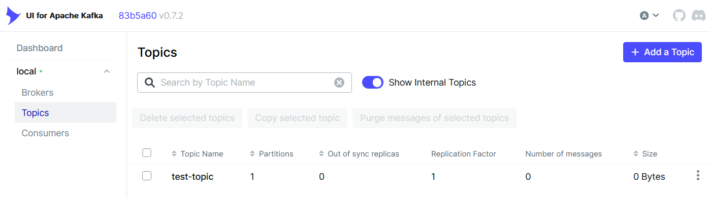
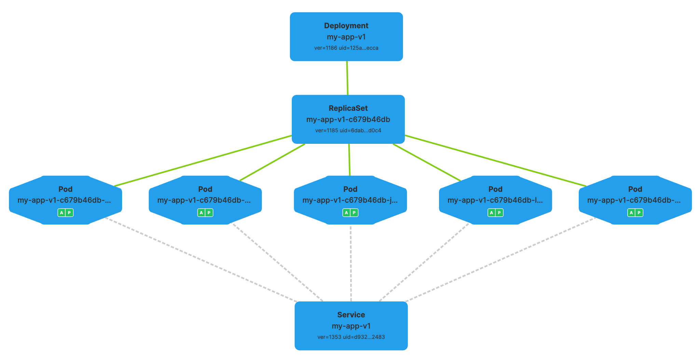
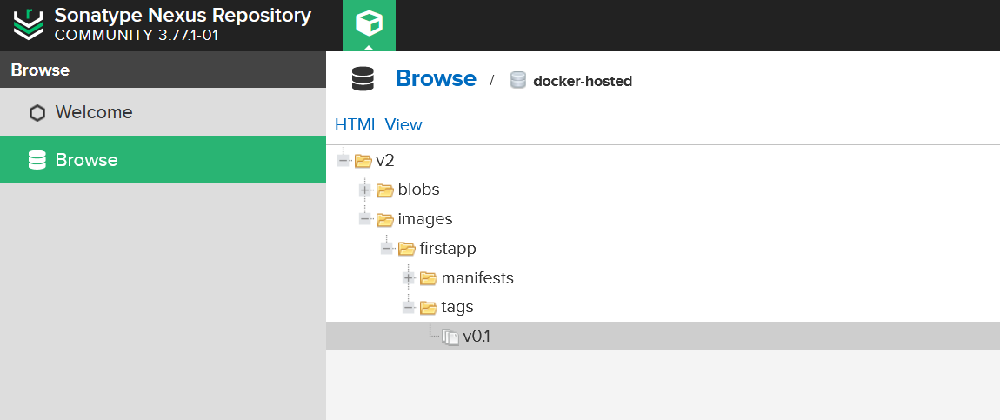
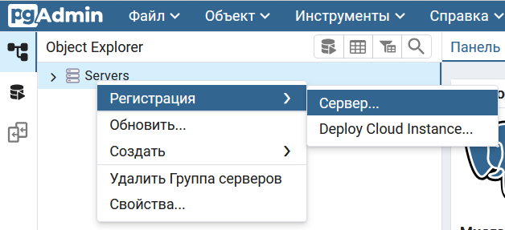
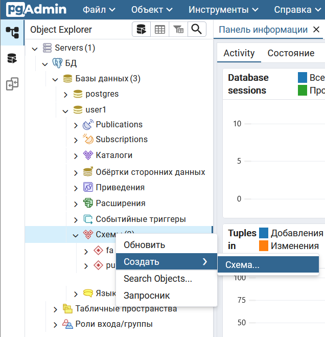
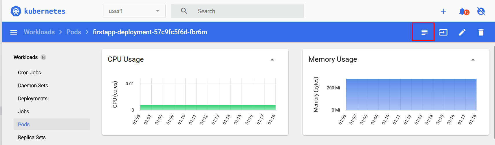
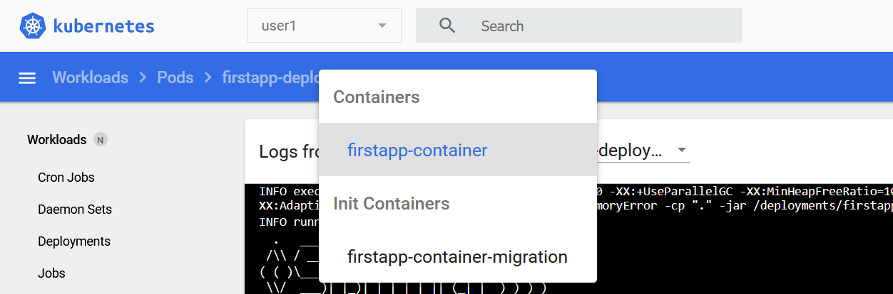
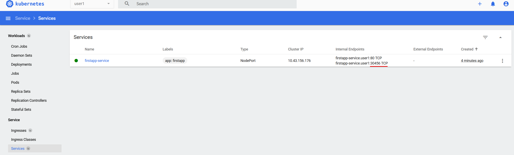

<!-- TOC -->
* [Теория](#теория)
  * [Git](#git)
    * [Основные понятия и команды](#основные-понятия-и-команды)
    * [Git Flow](#git-flow)
    * [Графическая оболочка для работы с git](#графическая-оболочка-для-работы-с-git)
  * [Системы сборки](#системы-сборки)
    * [Maven](#maven)
  * [IoC, DI, Spring](#ioc-di-spring)
    * [Теоретическая информация](#теоретическая-информация)
  * [Spring Boot](#spring-boot)
  * [Ресурсы](#ресурсы)
    * [REST](#rest)
    * [DTO](#dto)
  * [ORM, JPA](#orm-jpa)
  * [Аутентификация и авторизация](#аутентификация-и-авторизация)
* [Технологии](#технологии)
  * [MapStruct](#mapstruct)
  * [Liquibase](#liquibase)
  * [JWT (JSON Web Tokens)](#jwt-json-web-tokens)
  * [Apache Kafka](#apache-kafka)
  * [Swagger (Springdoc)](#swagger-springdoc)
  * [Spring Security](#spring-security)
  * [FeignClient](#feignclient)
  * [Hibernate JPA Model Generator (hibernate-jpamodelgen)](#hibernate-jpa-model-generator-hibernate-jpamodelgen)
  * [Specifications](#specifications)
  * [Lombok](#lombok)
  * [Spring Email](#spring-email)
  * [JUnit](#junit)
  * [Docker](#docker)
    * [Сборка образа](#сборка-образа)
  * [Docker Compose](#docker-compose)
    * [Запуск сервисов](#запуск-сервисов)
* [Создание проекта, структура](#создание-проекта-структура)
  * [Создание основного проекта](#создание-основного-проекта)
  * [Многомодульная структура](#многомодульная-структура)
* [Kubernetes](#kubernetes)
  * [Инфраструктура](#инфраструктура)
    * [Postgres](#postgres)
    * [Kafka](#kafka)
    * [Почта](#почта)
  * [Основные понятия](#основные-понятия)
  * [Развертывание приложения в kubernetes](#развертывание-приложения-в-kubernetes)
    * [Сборка образа](#сборка-образа-1)
    * [Создание схемы БД](#создание-схемы-бд)
    * [Создание ConfigMaps и Secrets](#создание-configmaps-и-secrets)
    * [Создание Deployment и запуск приложения](#создание-deployment-и-запуск-приложения)
* [Задание](#задание)
  * [User Service](#user-service)
    * [Описание](#описание)
    * [REST API](#rest-api)
    * [База данных](#база-данных)
    * [Подробное описание](#подробное-описание)
  * [Task Service](#task-service)
    * [Описание](#описание-1)
    * [REST API](#rest-api-1)
    * [База данных](#база-данных-1)
    * [Подробное описание](#подробное-описание-1)
    * [Отправка сообщений](#отправка-сообщений)
  * [Notification Service](#notification-service)
    * [Описание](#описание-2)
    * [REST API](#rest-api-2)
    * [База данных](#база-данных-2)
    * [Подробное описание](#подробное-описание-2)
<!-- TOC -->

# Теория

## Git

Git — это инструмент, который помогает разработчикам управлять изменениями в коде. Представьте себе, что вы пишете
большой проект, и вам нужно отслеживать, кто и какие изменения сделал, а также иметь возможность вернуться к предыдущей
версии кода, если что-то пойдет не так.

Скачать Git — <https://git-scm.com/downloads>

### Основные понятия и команды

- Репозиторий (Repository). Репозиторий — это место, где хранится ваш проект. Он содержит всю историю изменений, файлы и
  метаданные проекта. Репозиторий может быть локальным (на вашем компьютере) или удалённым (например, на GitHub).
- Коммит (Commit). Коммит — это сохранение изменений в репозитории. Каждый коммит содержит снимок состояния вашего
  проекта
  в определённый момент времени. Коммиты имеют уникальные идентификаторы (хэши) и могут включать сообщение, описывающее
  сделанные изменения.
- Ветка (Branch). Ветка — это отдельная линия разработки. Ветки позволяют работать над разными функциями или
  исправлениями
  параллельно. Основная ветка проекта часто называется `master`. Ветки могут быть объединены (слияние) для интеграции
  изменений.
- Слияние (Merge). Слияние — это процесс объединения изменений из одной ветки в другую. Например, после завершения
  работы
  над новой функцией в отдельной ветке, вы можете слить её в основную ветку.
- Конфликт (Conflict). Конфликт возникает, когда Git не может автоматически объединить изменения из разных веток. Это
  может произойти, если изменения были внесены в одну и ту же часть файла. Конфликты нужно решать вручную.
- Удаленный репозиторий (Remote Repository). Удаленный репозиторий — это версия вашего репозитория, которая хранится на
  сервере, таком как `GitHub`, `GitLab` или `Bitbucket`. Удаленные репозитории используются для совместной работы и
  резервного
  копирования.
- Клонирование (Clone). Клонирование — это процесс создания копии удаленного репозитория на вашем локальном компьютере.
  Команда `git clone` используется для клонирования репозитория.
- Фетч (Fetch). Команда `git fetch` загружает изменения из удаленного репозитория, но не объединяет их с вашим локальным
  репозиторием. Это позволяет вам видеть, какие изменения были внесены другими, прежде чем интегрировать их.
- Пулл (Pull). Команда `git pull` загружает изменения из удаленного репозитория и автоматически объединяет их с вашим
  локальным репозиторием. Это сочетание команд `git fetch` и `git merge`.
- Пуш (Push). Команда `git push` отправляет ваши локальные изменения в удаленный репозиторий. Это позволяет другим
  видеть и
  использовать ваши изменения.
- Индекс (Index). Индекс — это область, где хранятся изменения, готовые для коммита. Команда `git add` используется для
  добавления изменений в индекс.
- .gitignore. Файл `.gitignore` содержит список файлов и директорий, которые Git должен игнорировать. Это полезно для
  исключения временных файлов, конфигураций и других ненужных элементов. Файл, как правило, располагается в корневой
  папке
  проекта и в подмодулях.
- Тег (Tag). Тег — это метка, которая используется для обозначения определённых точек в истории коммитов.
  Теги позволяют легко находить и обращаться к версиям проекта.
- Ребейз (Rebase). Команда `git rebase` позволяет перенести или объединить серию коммитов с одной ветки на другую. Это
  может
  помочь сделать историю коммитов более чистой и линейной.
- Чек-аут (Checkout). Команда `git checkout` позволяет переключаться между ветками или восстанавливать файлы до
  определённого состояния из истории коммитов.
- Хед (HEAD). `HEAD` — это указатель на текущий коммит или ветку, на которой вы сейчас находитесь. Обычно `HEAD`
  указывает на
  последний коммит в текущей ветке.

Подробнее о Git:
1. [https://skillbox.ru/media/code/chto_takoe_git_obyasnyaem_na_skhemakh/](https://skillbox.ru/media/code/chto_takoe_git_obyasnyaem_na_skhemakh/)
2. [https://habr.com/ru/articles/541258/](https://habr.com/ru/articles/541258/)
3. [https://skillbox.ru/media/code/gitlab-chto-eto-takoe-i-kak-im-polzovatsya/](https://skillbox.ru/media/code/gitlab-chto-eto-takoe-i-kak-im-polzovatsya/)

Потренироваться: [https://learngitbranching.js.org/?locale=ru_RU](https://learngitbranching.js.org/?locale=ru_RU)

### Git Flow

Есть несколько правил и рекомендаций для организации работы с Git. Как правило, они выбираются в зависимости от проекта
и зависят, например, от размера команды, частоты релизов и т.д. Подробнее про них можно почитать
тут <https://bool.dev/blog/detail/git-branching-strategies>. О GitFlow:
1. [https://habr.com/ru/articles/767424/](https://habr.com/ru/articles/767424/)
2. [https://www.atlassian.com/git/tutorials/comparing-workflows/gitflow-workflow](https://www.atlassian.com/git/tutorials/comparing-workflows/gitflow-workflow)

Ниже перечислены основные названия и применение веток, которые могут быть применимы к разным flow.

- `master`: Основная ветка, содержащая стабильный и готовый к выпуску код.
- `develop`: Ветка для разработки, содержащая последний интегрированный код.
- `feature/*`: Ветки для разработки новых функций. Создаются от `develop` и после завершения работы сливаются обратно в
  `develop`.
- `release/*`: Ветки для подготовки к релизу. Создаются от develop и после завершения работы сливаются в `master` и
  develop.
- `hotfix/*`: Ветки для исправления критических ошибок. Создаются от master и после завершения работы сливаются
  в `master`
  и develop.

### Графическая оболочка для работы с git

Для работы с git можно использовать консоль и писать команды вручную, однако удобнее использовать графические оболочки.
В IntelliJ IDEA есть встроенное GUI для работы с git, но можно рассмотреть и альтернативные варианты, например
Sourcetree.

Скачать <https://www.sourcetreeapp.com>

## Системы сборки

**Описание:**
Системы сборки — это такие программные продукты, которые на основе некоторой конфигурации могут «собрать» ваш проект.
Под словом «собрать» здесь может скрываться очень обширный объем работы, который при «ручном» подходе требует значительных затрат времени.
Небольшой перечень для ясности:
- загрузить зависимые библиотеки для вашего проекта из сети (репозитория);
- скомпилировать классы модуля или всего проекта;
- сгенерировать дополнительные файлы: SQL-скрипты, XML-конфиги и т.п.;
- удалять/создавать директории и копировать в них указанные файлы;
- упаковка скомпилированных классов проекта в архивы различных форматов: zip, rar, rpm, jar, ear, war и др.;
- компиляция и запуск модульных тестов (unit-test) вашего проекта с результатами выполнения тестов и расчетом процента покрытия;
- установка (deploy) файлов проекта на удаленный сервер;
- генерация документации и отчетов.

Почитать о них можно тут: [Системы сборки Java-проектов](https://zhukovsd.github.io/java-backend-learning-course/technologies/build-systems/)

### Maven

Maven — это инструмент для управления проектами и автоматизации сборки, используемый в Java. Он предоставляет
стандартизированный способ управления зависимостями, компиляции, тестирования и упаковки приложений. Maven использует
файл конфигурации `pom.xml` (Project Object Model), который описывает проект, его зависимости, плагины и цели сборки.

Дополнительно о Maven:
1. [Основы Maven: что это такое и как работает](https://skillbox.ru/media/code/osnovy-maven-chto-eto-takoe-i-kak-rabotaet/)
2. [Apache Maven — основы](https://habr.com/ru/articles/77382/)

Пример конфигурация `pom.xml` можно посмотреть в текущем проекте.

## IoC, DI, Spring

**Описание:**
Уже много лет "Инверсия управления" считается стандартом разработки. Мы не управляем ЖЦ создания компонентов, передавая эту ответственность различным фреймворкам, мы только указываем какой-то минимальный необходимый набор параметров для создания этих самых компонентов.

### Теоретическая информация

Что же такое IoC:
  - [IoC, DI и DL](https://alexkosarev.name/2019/06/20/ioc-di-and-dl/)
  - [Inversion of Control](https://www.baeldung.com/cs/ioc)

DI является реализацией IoC:
  - [Что такое Dependency Injection](https://apptractor.ru/info/articles/dependency-injection.html)
  - [Внедрение зависимостей (Dependency Injection)](https://habr.com/ru/articles/434380/)
  - [IoC, DI, IoC-контейнеры и немного про Spring](https://habr.com/ru/articles/131993/)

Про Spring:
  - [Spring](https://blog.skillfactory.ru/glossary/spring/)
  - [Spring Framework: Обзор](https://habr.com/ru/articles/490586/)
  - [Фреймворк Spring: зачем он нужен, как устроен и как работает](https://skillbox.ru/media/code/freymvork-spring-zachem-on-nuzhen-kak-ustroen-i-kak-rabotaet/)

## Spring Boot

**Описание:**
Spring — это фреймворк для Java, на котором пишут веб-приложения и микросервисы. А Spring Boot — это расширение, которое упрощает и ускоряет работу со Spring. Оно представляет собой набор утилит, автоматизирующих настройки фреймворка.

Spring Boot разработан для ускорения создания веб-приложений. Он отличается от своего «родителя» тем, что не требует сложной настройки и имеет ряд встроенных инструментов, упрощающих написание кода.

В отличие от базового фреймворка, он умеет:
- упаковывать зависимости в стандартные starter-пакеты;
- автоматически конфигурировать приложения с помощью jar-зависимостей;
- использовать JavaConfig, что позволяет отказаться от использования XML;
- не зависеть от множественного импорта Maven и конфликтов версий, связанных с этим;
- обеспечивать мощную пакетную обработку и управлять конечными точками RES;
- упрощать интеграцию с другими Java-фреймворками, такими как JPA / Hibernate ORM, Struts и так далее;
- локально запускать встроенные HTTP-серверы, такие как Tomcat и Jetty, упрощая разработку и тестирование веб-приложений.

Подробнее:

1. [Introducing Spring Boot](https://topjava.ru/blog/introducing-spring-boot)
2. [Что такое Spring Boot, его преимущества и как начать с ним работать](https://gitverse.ru/blog/articles/development/198-chto-takoe-spring-boot-ego-preimushestva-i-kak-nachat-s-nim-rabotat)
3. [Spring Boot Tutorial – Bootstrap a Simple Application](https://www.baeldung.com/spring-boot-start)

В статьях упоминаются сервлеты и контейнеры сервлетов, **коротко** о них:
1. [Сервлет](https://blog.skillfactory.ru/glossary/servlet/)
2. [Apache Tomcat](https://blog.skillfactory.ru/glossary/apache-tomcat/)

Дополнительно:
1. [Spring Boot – YAML vs Properties](https://www.baeldung.com/spring-boot-yaml-vs-properties)
2. [Ещё раз о пропертях или откуда что берётся](https://habr.com/ru/articles/740802/)

## Ресурсы

### REST

**Описание:**
REST API (Representational State Transfer) – это архитектурный подход, описывающий рамки взаимодействия с API (приложений в сети). Это не протокол, а скорее список рекомендаций.
API (Application Programming Interface) представляет собой набор определений и протоколов. Разработчики создают API-интерфейсы для взаимодействия и обмена данными одного приложения или сайта с другими. API функционирует как своеобразный шлюз или посредник между клиентами и сервером.
Интерфейс API разрабатывается таким образом, чтобы программное обеспечение могло запросить определенный тип данных через сеть. Интерфейс совместим с любыми языками программирования, операционными системами, программами, сайтами, приложениями, flash и т.д.

Почитать:
- [Что такое REST?](https://systems.education/what-is-rest#showmore)
- [REST API: что это такое и как работает](https://skillbox.ru/media/code/rest-api-chto-eto-takoe-i-kak-rabotaet/)
- [REST API](https://blog.skillfactory.ru/glossary/rest-api/)

### DTO

**Описание:**
Зачастую, в клиент-серверных приложениях, данные на клиенте (слой представления) и на сервере (слой бизнес логики) структурируются по-разному. На стороне сервера это дает нам возможность комфортно хранить данные в базе данных или оптимизировать использование данных в угоду производительности, в то же время заниматься user-friendly отображением данных на клиенте.

Что такое DTO и чем отличается от других объектов:
- [Различия между DTO, VO, POJO, JavaBeans](https://sky.pro/media/razlichiya-mezhdu-dto-vo-pojo-javabeans/)

В целом, мы можем перекладывать данные из одного объекта в другой в "ручном" режиме, но можем и автоматизировать этот процесс с помощью библиотек. Например, Mapstruct:
- [MapStruct: автоматизация маппинга в Java](https://habr.com/ru/articles/818489/)
- [MapStruct – Java Bean Mappings](https://www.baeldung.com/mapstruct)

## ORM, JPA

**Описание:**
ORM (Object-Relational Mapping) — это технология, которая обеспечивает преобразование данных между классами в объектно-ориентированном программировании и таблицами в реляционных базах данных, предоставляя интерфейс для CRUD-операций. JPA (Java Persistence API) — это стандарт Java для ORM, упрощающий управление данными между Java-объектами и СУБД.

Короткая напоминалка:
- [ORM](https://blog.skillfactory.ru/glossary/orm/)

Есть несколько реализаций этой технологии, в Spring мы стандартно пользуемся JPA:
- [Spring Data JPA: работа с данными в стиле Spring](https://habr.com/ru/companies/otus/articles/686082/)
- [The Persistence Layer with Spring Data JPA](https://www.baeldung.com/the-persistence-layer-with spring-data-jpa)
- [Getting Started](https://docs.spring.io/spring-data/jpa/reference/jpa/getting-started.html)

## Аутентификация и авторизация

**Описание:**
Аутентификация — это процесс проверки личности пользователя, подтверждение того, что он является тем, за кого себя выдает (например, через логин и пароль).
Авторизация — это процесс определения прав доступа пользователя, то есть какие ресурсы или действия ему разрешены после успешной аутентификации.

Различие: аутентификация отвечает на вопрос «Кто вы?», а авторизация — на вопрос «Что вам разрешено делать?».

Подробнее:
- [Аутентификация и авторизация](https://habr.com/ru/articles/720842/)
- [Spring Security – Authentication vs Authorization](https://www.baeldung.com/spring-security-authentication-vs-authorization)
# Технологии

## MapStruct

**Описание:**
MapStruct — это библиотека Java для автоматической генерации кода маппинга между объектами (например, между сущностями и DTO) на этапе компиляции. Она упрощает преобразование данных, минимизируя рутинный код, обеспечивает высокую производительность за счёт использования прямых вызовов методов (без рефлексии) и поддерживает настройку маппингов через аннотации, включая сложные случаи, такие как вложенные объекты и коллекции.

Подробнее:

- [MapStruct. Reference Guide](https://mapstruct.org/documentation/stable/reference/html/)
- [Quick Guide to MapStruct](https://www.baeldung.com/mapstruct)

## Liquibase

**Описание:**
Liquibase — это инструмент для управления версиями базы данных, который позволяет отслеживать, управлять и применять
изменения схемы базы данных. Он поддерживает различные типы баз данных и позволяет автоматизировать процесс миграции.

Все миграции в микросервисе должны находиться в модуле `-db` в папке `resources`. Пример пустой миграции находится
текущем проекте. Запустить миграции можно командой:

```
mvn install liquibase:update -f firstapp-db/pom.xml -Dliquibase.host=localhost -Dliquibase.port=5432 -Dliquibase.db=db_name -Dliquibase.schema=frstapp -Dliquibase.user=postgres -Dliquibase.password=postgres
```

подставив переменные для своей БД.

**Полезные ссылки:**

- [Liquibase Official Documentation](https://www.liquibase.org/documentation/index.html)

## JWT (JSON Web Tokens)

**Описание:**
JWT (JSON Web Tokens) — это стандарт для создания токенов доступа, которые могут быть использованы для аутентификации и
авторизации. JWT состоит из трех частей: заголовка, полезной нагрузки и подписи.

**Полезные ссылки:**

- [JWT Parser](https://jwt.io)

## Apache Kafka

**Описание:**
Apache Kafka — это распределённая потоковая платформа, которая используется для построения систем реального времени.
Kafka позволяет публиковать и подписываться на потоки записей, сохранять потоки записей и обрабатывать их.

**Полезные ссылки:**

- [Apache Kafka Official Documentation](https://kafka.apache.org/documentation/)
- [Spring Boot + Kafka Integration Example](https://www.baeldung.com/spring-kafka)

## Swagger (Springdoc)

**Описание:**
Springdoc OpenAPI — это библиотека, которая автоматизирует генерацию документации OpenAPI 3.0 для RESTful API,
реализованных на основе Spring Boot. Она предоставляет аннотации и конфигурации для легкой интеграции и генерации
спецификации API.

**Полезные ссылки:**

- [Springdoc OpenAPI Official Documentation](https://springdoc.org/)
- [Spring Boot + Springdoc OpenAPI Integration Example](https://www.baeldung.com/spring-rest-openapi-documentation)

## Spring Security

**Описание:**
Spring Security — это мощный и настраиваемый фреймворк для обеспечения безопасности приложений на платформе Spring. Он
предоставляет все необходимые средства для аутентификации и авторизации пользователей, защиты веб-приложений от
различных атак (например, CSRF, XSS) и управления доступом на основе ролей и политик.

**Полезные ссылки:**

- [Spring Security Official Documentation](https://docs.spring.io/spring-security/reference/index.html)
- [Creating a Spring Security Key for Signing a JWT Token](https://www.baeldung.com/spring-security-sign-jwt-token)

## FeignClient

**Описание:**
FeignClient — это декларативный веб-клиент для упрощения вызовов REST API. Он интегрируется с Spring Boot и позволяет
легко взаимодействовать с другими микросервисами, используя аннотации для определения HTTP-запросов.

**Полезные ссылки:**

- [Spring Boot + FeignClient Integration Example](https://www.baeldung.com/spring-cloud-openfeign)

## Hibernate JPA Model Generator (hibernate-jpamodelgen)

**Описание:**
Hibernate JPA Model Generator (hibernate-jpamodelgen) — это инструмент для автоматической генерации метамоделей JPA.
Метамодели используются для создания типобезопасных запросов с использованием Criteria API.

**Подключение:**

```xml

<dependency>
    <groupId>org.hibernate.orm</groupId>
    <artifactId>hibernate-jpamodelgen</artifactId>
</dependency>
```

## Specifications

**Описание:**
Specifications — это часть Spring Data JPA, которая позволяет создавать динамические запросы к базе данных с
использованием критериев (Criteria API). Они предоставляют мощный и гибкий способ построения сложных запросов.

Для использования нужно подключить [hibernate-jpamodelgen](#hibernate-jpa-model-generator-hibernate-jpamodelgen).

**Полезные ссылки:**

- [Ищем с помощью Spring Data JPA](https://uthark.github.io/2012/04/24/spring-data-jpa/)


## Lombok

**Описание:**
Lombok — это библиотека для Java, которая значительно упрощает разработку, устраняя необходимость написания шаблонного
кода. Lombok аннотирует классы и автоматически генерирует код, такой как геттеры, сеттеры, конструкторы,
методы `equals`, `hashCode`, `toString` и многое другое.

**Полезные ссылки:**

- [Lombok Official Documentation](https://projectlombok.org/)
- [Spring Boot + Lombok Integration Example](https://www.baeldung.com/intro-to-project-lombok)

## Spring Email

**Описание:**
Spring Email — это часть Spring Framework, которая предоставляет удобный способ отправки email-сообщений с
использованием JavaMailSender. Spring Email интегрируется с различными email-серверами и позволяет легко конфигурировать
и отправлять email-сообщения в приложениях Spring Boot.

**Полезные ссылки:**

- [Spring Boot + Email Integration Example](https://www.baeldung.com/spring-email)

## JUnit

**Описание:**
JUnit — это популярный фреймворк для написания и выполнения тестов на языке программирования Java. JUnit поддерживает 
создание тестов, выполнение тестов, сбор и анализ результатов тестирования.

**Полезные ссылки:**

- [JUnit 5 User Guide](https://junit.org/junit5/docs/current/user-guide/)  
- [Spring Boot Testing](https://docs.spring.io/spring-boot/docs/current/reference/html/features.html#features.testing)  
- [Testing with Spring Boot](https://spring.io/guides/gs/testing-web/)  
- [Guide to Testing with Spring Boot](https://www.baeldung.com/spring-boot-testing)


## Docker

**Описание:**
Docker - это платформа для автоматизации развёртывания, масштабирования и управления приложениями в контейнерах.
Она позволяет разработчикам упаковывать приложения и все необходимые зависимости в стандартизированные единицы,
которые могут работать в любом окружении, обеспечивая консистентность и изоляцию.

### Сборка образа

В модулях `-db` и `-impl` текущего проекта находятся примеры Dockerfile.  
Для самостоятельной сборки образа нужно сначала собрать проект `mvn package`, после этого в папке `target`
появятся `.jar` файлы, имена которых нужно указать в Dockerfile.
В командной строке, находясь в нужном модуле, выполнить команду `docker build . -t firstapp-db` для сборки образа в
модуле `-db`, и `docker build . -t firstapp` для сборки образа модуле `-impl`.

**Полезные ссылки:**

- [Introduction to Docker](https://habr.com/ru/companies/ruvds/articles/438796/)
- [Docker Documentation](https://docs.docker.com)

## Docker Compose

**Описание:**
Docker Compose - это инструмент, предназначенный для определения и управления многоконтейнерными Docker-приложениями. 
С помощью файла `docker-compose.yml` можно описать конфигурацию всех контейнеров, сетей и томов, 
необходимых для работы приложения, и запускать их одной командой.

### Запуск сервисов
В папке `compose` основного модуля находится пример docker compose файла. Для запуска сервисов выполнить команду
`docker-compose up`. Образы из модулей `-db` и `-impl` должны быть предварительно собраны. 

Для создания схемы БД используется скрипт `compose/postgres/init/init.sql`.  
Задать environment переменные можно в самом `docker-compose.yml`, как это сделано для модуля `-db`, так и в отдельном файле
`compose/firstapp/application.env` как это сделано для модуля `-impl`.

**Полезные ссылки:**

- [Introduction to Docker Compose](https://habr.com/ru/companies/ruvds/articles/450312/)
- [Docker Compose Documentation](https://docs.docker.com/compose/)


# Создание проекта, структура

## Создание основного проекта

Создадим новое Spring Boot приложения с использованием Maven.

Для этого можно воспользоваться сервисом [https://start.spring.io](https://start.spring.io/) или создать новое
приложение сразу в `IntelliJ IDEA`. Будем использовать второй вариант, для этого выберем `File -> New -> Project`. В
диалоговом окне слева выберем Spring Boot и заполним поля.


**Type**: Maven.  
**Language**: Java.  
**Group**: Группа проекта, например, ru.cinimex  
**Artifact**: Название сервиса, например, firstapp.  
**Name:** Название сервиса, например, firstapp.  
**Description:** Описание, например, First Spring Boot Project.  
**Package name**: По умолчанию будет ru.cinimex. firstapp.  
**Packaging**: Jar.  
**Java**: 17.

На следующем экране можно выбрать версию Spring Boot и дополнительные зависимости.

Нажмем на кнопку Create. Мы должны получить следующую структуру


## Многомодульная структура

Многомодульная структура позволяет разделить проект на логически изолированные части, что облегчает управление,
тестирование и повторное использование кода. Модули могут иметь разные названия и назначения, но мы будем использовать
три модуля:

- `api` - предназначен для хранения интерфейсов контроллеров и DTO;
- `db` - предназначен для хранения миграций базы данных;
- `impl` - содержит всю остальную логику приложения, включая реализации сервисов, репозиториев и бизнес-логику.

Для добавления модуля щёлкнем правой кнопкой мыши на корневом проекте в дереве проекта и выберите New -> Module. В
диалоговом окне слева выберем Java и заполним поля:

**Group:** ru.cinimex  
**Artifact:** firstapp-api  
**Name:** firstapp-api  
**Parent:** firstapp (должен быть главный модуль)


Аналогично заполняем для остальных модулей.

После добавления всех модулей нужно провести небольшой рефактор структуры. Удалим папку `src` из модуля `impl` и
перенесем
туда папку `src` из главного модуля. Удалим папку `src/test` из модуля api. Удалим папки `src/test` и `src/main/java` из
модуля
`db`. Скопируем файл `.gitignore` из корневого модуля в три дочерние.

Добавим базовые пакеты в модуль `api` и `impl`. Пакеты можно добавлять по мере их надобности. Пример получившейся
структуры:


# Kubernetes

## Инфраструктура

### Postgres
Работать с БД можно из https://pgadmin.esxo-kube.cmx.ru

Логин - ваш логин
Пароль - выданный пароль

Внутренний адрес, для приложений: `postgres.infra.svc.cluster.local:5432`
Для доступа к postgres с локального компьютера: `esxo-kube.cmx.ru:32000`

### Kafka

Посмотреть топики и сообщения в них можно из UI https://kafka-ui.esxo-kube.cmx.ru


> [!IMPORTANT]
> В именах своих топиков используйте свой логин, чтобы не конфликтовать с другими, например `notification.message.user1.in`

Внутренний адрес, для приложений: `kafka.infra.svc.cluster.local:9093`
Для доступа к kafka с локального компьютера: `esxo-kube.cmx.ru:32001`

В Secrets вашего namespace есть сертификаты (kafka-certs) и пароли к ним (kafka-ssl-password) для подключения к кафке.
Их можно скачать и использовать для локальной работы.

### Почта

Посмотреть сообщения можно через https://webmail.esxo-kube.cmx.ru/
Логин - ваш_логин@esxo-kube.cmx.ru
Пароль - выданный пароль

Внутренний адрес smpt, для приложений: `stalwart.infra.svc.cluster.local:587`
Для отправки почты с локального компьютера `по smtp: esxo-kube.cmx.ru:30587`

> [!IMPORTANT]
> Для отправки сообщений нужно отключить проверку сертификатов 
> spring.mail.properties.mail.smtp.ssl.trust = "*"

## Основные понятия


### Kubernetes
Система оркестрации контейнеров, которая автоматически запускает, масштабирует и управляет контейнерными приложениями в кластере серверов. Следит за состоянием приложений и перезапускает их при сбоях.

### Namespace
Логическое разделение ресурсов внутри одного Kubernetes-кластера. Используется для изоляции проектов, команд или окружений (например dev, test, prod).

### ConfigMaps и Secrets
ConfigMap хранит конфигурационные данные приложения (переменные окружения, настройки).
Secret хранит чувствительные данные (пароли, токены, ключи) в более защищённом виде.

### Pods
Pod — минимальная единица запуска в Kubernetes. Он содержит один или несколько контейнеров, которые используют общую сеть и хранилище.

### Deployments
Deployment управляет созданием и обновлением Pod. Он обеспечивает обновления без простоя, масштабирование и откат на предыдущие версии приложения.

### ReplicaSets
ReplicaSet гарантирует, что в любой момент запущено заданное количество Pod. Если Pod падает или удаляется, ReplicaSet автоматически создаёт новый.

### Services
Service предоставляет стабильный сетевой адрес для доступа к Pod. Он также выполняет балансировку нагрузки между несколькими Pod.

### Ingresses
Ingress управляет внешним HTTP/HTTPS доступом к сервисам внутри кластера. Позволяет маршрутизировать запросы по доменам и URL-путям.

### StatefulSets
StatefulSet используется для приложений с состоянием (например баз данных). Он обеспечивает стабильные имена Pod, порядок запуска и постоянное хранилище данных.

### Init-контейнер
Init-контейнер запускается перед основными контейнерами Pod и выполняет подготовительные задачи. Например, проверяет доступность базы данных или загружает необходимые данные перед стартом приложения.

## Развертывание приложения в kubernetes
### Сборка образа
Залогинимся в docker репозитории с использованием выданных логина и пароля
`docker login docker-nexus.esxo-kube.cmx.ru`

Соберем образ и поставим ему тег (`-t`)
`docker build -t docker-nexus.esxo-kube.cmx.ru/images/user1/firstapp:v0.1 .`

Где тег состоит из
- docker-nexus.esxo-kube.cmx.ru - адрес docker репозитория
- images - папка в которой будет храниться наш образ
- user1 - ваш логин
- firstapp - название образа
- v0.1 - версия образа

Загрузим собранный образ в репозиторий
`docker push docker-nexus.esxo-kube.cmx.ru/images/user1/firstapp:v0.1`

Посмотреть загруженный образ можно по адресу https://nexus.esxo-kube.cmx.ru


Аналогично нужно собрать и запушить модуль `-db`.

### Создание схемы БД

Перейти по https://pgadmin.esxo-kube.cmx.ru, ввести выданный логин/пароль.

В появившимся окне, на вкладке Общие, задать любое имя подключения. На вкладке Соединение заполнить

- Имя/адрес сервера - postgres.infra.svc.cluster.local
- Порт - 5432
- Имя пользователя - выданный логин
- Пароль - выданный пароль
- Сохранить пароль? - да



Далее создадим схему, задав ей имя, которое используете в своем приложении




### Создание ConfigMaps и Secrets
Зайдем в консоль kubernetes по адресу https://dashboard.esxo-kube.cmx.ru, залогинимся через "Log in with OpenLDAP".
В верхнем левом углу выберем namespace в котором будем разворачивать наше приложение, его название совпадает с логином.

Сейчас настройки приложения хранятся в файле `application.yml`. Эти настройки невозможно изменить не пересобирая приложение, однако их можно переопределить, для этого будем использовать ConfigMaps и Secrets.

Создадим ConfigMap, для этого в правом верхнем углу нажмем на `+`. В появившемся редакторе введем

```yaml
apiVersion: v1
kind: ConfigMap
metadata:
  name: firstapp-config # название ConfigMap
data:
  DB_URL: "jdbc:postgresql://esxo-kube.cmx.ru:32000/firstapp?currentSchema=fa"
  DB_SCHEMA: "fa"
  JPA_SHOW_SQL: "true"
```

Аналогично создадим Secret, указав свой логин и пароль 

```yaml
apiVersion: v1
kind: Secret
metadata:
  name: firstapp-secret # название Secret
type: Opaque
stringData:
  db_username: "postgres"
  db_password: "postgres"
  jwt_secret: "3MZ7BDeA3j4p9GXrHYFYNSKfMUs_yxjQPNx#JhFEjj#b7@7mBN#Ifatux4q0bbSMW345A_dRFu0tG3yqdrHCAKVupami2FIIpk3K"
```

Созданные ConfigMaps и Secret можно посмотреть или отредактировать в соответствующем меню консоли kubernetes

### Создание Deployment и запуск приложения

Создадим Deployment для развертывания нашего приложения 

```yaml
apiVersion: apps/v1
kind: Deployment     # Тип ресурса — Deployment
metadata:
  name: firstapp     # Имя Deployment'а
spec:
  replicas: 1        # Количество подов, которые нужно запустить
  selector:
    matchLabels:
      app: firstapp  # Селектор, который определяет, какие поды входят в этот Deployment
  template:
    metadata:
      labels:
        app: firstapp  # Метка, которая должна соответствовать селектору выше

    spec:
      # --- Init контейнер для запуска миграций ---
      initContainers:
        - name: firstapp-container-migration  # Имя init-контейнера
          image: docker-nexus.esxo-kube.cmx.ru/images/user1/firstapp-db:v0.1  # Образ для выполнения миграций
          env:
            - name: DB_URL
              valueFrom:
                configMapKeyRef:
                  name: firstapp-config    # Значение из ConfigMap (например, jdbc URL)
                  key: DB_URL
            - name: DB_SCHEMA
              valueFrom:
                configMapKeyRef:
                  name: firstapp-config    # Схема базы данных из ConfigMap
                  key: DB_SCHEMA
            - name: DB_LOGIN
              valueFrom:
                secretKeyRef:
                  name: firstapp-secret    # Логин из Kubernetes Secret
                  key: db_username
            - name: DB_PASSWORD
              valueFrom:
                secretKeyRef:
                  name: firstapp-secret    # Пароль из Kubernetes Secret
                  key: db_password

      # --- Основной контейнер с приложением ---
      containers:
        - name: firstapp-container
          image: docker-nexus.esxo-kube.cmx.ru/images/user1/firstapp:v0.1  # Образ приложения
          ports:
            - containerPort: 8080  # Порт, который слушает приложение внутри контейнера
          envFrom:
            - configMapRef:
                name: firstapp-config  # Загрузка всех переменных из ConfigMap как окружение
          env:
            - name: DB_LOGIN
              valueFrom:
                secretKeyRef:
                  name: firstapp-secret  # Логин к БД
                  key: db_username
            - name: DB_PASSWORD
              valueFrom:
                secretKeyRef:
                  name: firstapp-secret  # Пароль к БД
                  key: db_password
            - name: JWT_SECRET
              valueFrom:
                secretKeyRef:
                  name: firstapp-secret  # Секрет для подписи JWT
                  key: jwt_secret
```
После нажатия кнопки Upload, помимо созданного Deployment, в меню Pod появится наш запущенный контейнер. 
Перейдя в контейнер мы увидим подробную информацию и потреблении CPU, памяти и т.д.

Нажав на иконку с полосками, можно посмотреть логи, как init-контейнера, так и логи основного приложения.



Создадим Service для доступа к нашему приложению

```yaml

apiVersion: v1
kind: Service
metadata:
  name: firstapp-service   # имя сервиса
  labels:
    app: firstapp
spec:
  type: NodePort
  selector:
    app: firstapp
  ports:
    - protocol: TCP
      port: 80             # внутренний порт сервиса
      targetPort: 8080     # порт приложения в контейнере
      # nodePort: 30080    # внешний порт по которому будет доступен сервис, не будем его указывать, чтобы Kubernetes выбрал его сам
```
Посмотреть выданный порт можно в меню Services



Теперь развернутый сервис доступен по адресу http://esxo-kube.cmx.ru:30456/

# Задание

**Тема:** Система отправки напоминаний пользователям

**Описание:** Система для напоминаний о задачах должна автоматически отправлять пользователям уведомления о предстоящих
задачах. Она должна позволять пользователям настраивать дату и время отправки уведомлений, а так же их периодичность.

Система состоит из трех микросервисов:

- User Service
- Task Service
- Notification Service


Задание состоит из двух частей:
1) Разработать 3 сервиса в соответствии с подробным описанием ниже. Создать один [Docker Compose](#docker-compose), который будет запускать эти сервисы, а также необходимые для них компоненты (Postgresql и [Apache Kafka](#apache-kafka))
2) Задеплоить разработанные сервисы в kubernates с готовой инфраструктурой.

## User Service

### Описание

Сервис должен предоставлять REST API для регистрации и аутентификация пользователей, а так же дополнительные API для
администратора. В сервисе должен быть настроен [spring security](#spring-security) для
выдачи [JWT](#jwt-json-web-tokens) токенов зарегистрированным пользователям.

### REST API

- POST /register - Регистрация нового пользователя.
- POST /register/code - Подтверждение почты с помощью кода.
- POST /auth/login - Аутентификация пользователя
- GET /users/current - Получить информацию о текущем пользователе, логин пользователя брать из jwt токена
- GET /admin/users/{login} - Получить информацию о пользователе по логину администратором или техническим пользователем
- POST /admin/tech/token - Сгенерировать токен технического пользователя

### База данных

Таблица user:

``` postgresql
  id uuid (обязательное, первичный ключ)
  username varchar(100) (обязательное, уникальное, добавить индекс)
  password varchar(255) (обязательное)
  email varchar(200)(обязательное, уникальное)
  role varchar(10) (обязательное, варианты значений [USER, ADMIN])
  is_active boolean (обязательное, по умолчанию false)
  created_at timestamptz (обязательное)
  updated_at timestamptz (обязательное)
```

Таблица temp_code:

``` postgresql
  id uuid (обязательное, первичный ключ)
  user_id uuid (обязательное, внешний ключ на таблицу user)
  code varchar(6) (код подтверждения, обязательное)
```

### Подробное описание

Создать сервис с тремя модулями `-api`, `-db`, `-impl`.

В модуле `-api` должны быть интерфейсы двух контроллеров (контроллер с регистрацией и аутентификацией пользователя,
и контроллер с получением информации о пользователе), а также классы dto, которые используются в интерфейсах.

Модуль `-db` должен содержать файлы миграции [Liquibase](#liquibase) для создания структуры БД. Нужно добавить 2 changeSet - создание
таблицы user и создание таблицы temp_code, каждый changeSet поместить в отдельный файл.
Модуль должен собираться в jar файл.

Модуль `-impl` должен содержать основные класса для работы приложения. В данный модуль должен подключаться модуль `-api`
для реализации интерфейсов. Модуль также должен собираться в jar файл.

В сервис нужно подключить [Lombok](#lombok) и расставить нужные аннотации.
В сервис нужно подключить [Swagger](#swagger-springdoc) и расставить нужные аннотации для описания API.
В сервисе нужно подключить [Spring security](#spring-security) и настроить ее для выдачи и
проверки [JWT](#jwt-json-web-tokens) токенов.
Пример можно найти в текущем проекте.
Реализации REST API должны быть помечены аннотацией `@PreAuthorize` с указанием роли.
В сервисе должна быть подключена [Kafka](#apache-kafka) и должен быть сконфигурирован `Producer` для отправки сообщения в топик
`notification.message.in`.

Покрыть все публичные методы классов в папке service `unit` и контроллеры тестами с помощью [JUnit](#junit).

Собрать [Docker](#docker) образ для `-db` и `-impl` модулей.

- #### POST /register
  **Входящие данные:** json c данными пользователя, например
  ```json
  {
    "username": "ivan",
    "password": "123",
    "email": "ivan@gmail.com"
  }
  ```
  **Роли:** доступно всем
  <br><br>
  **Алгоритм работы:**  
  Проверить, что пользователь с таким `username` или `email` не зарегистрирован в системе, то есть нет записей с таким
  `username` или `email` в таблице user и поле `is_active = false`. Если пользователь уже зарегистрирован — выбросить
  исключение.
  Используя [MapStruct](#mapstruct), конвертировать входящее DTO в `UserEntity`, использовать аннотацию `@AfterMapping` для
  заполнения остальных полей:
  ```
  id = рандомный UUID
  role = USER
  created_at = текущее дата и время
  updated_at = текущее дата и время
  password = использовать бин PasswordEncoder для хеширования пароля
  ```
  Заполнить таблицу `temp_code` (без маппера):
  ```
  id = рандомный UUID
  user_id = id из UserEntity
  code = случайный 6-значный цифровой код
  ```
  Сохранить изменения в БД. Все действия выше должны быть в одной транзакции.
  Отправить сообщение в сервис `Notification Service` через [Kafka](#apache-kafka). Пример сообщения
  ```json
  {
    "email": "ivan@gmail.com",
    "header": "Подтверждение почты",
    "body": "Ваш код подтверждения - 653218"
  }
  ```

  **Возвращаемое значение:**
    - HTTP code 200 и `id` созданной `UserEntity`, если пользователь успешно создан
    - HTTP code 400 и описание ошибки, если пользователь уже существует
    - HTTP code 500 и описание ошибки, если произошла другая ошибка


- #### POST /register/code
  **Входящие данные:**  
  json c кодом подтверждения и id пользователя, например
  ```json
  {
    "id": "c0c4a8d4-762f-4496-bfe0-06d0c19ebc8c",
    "code": "653218"
  }
  ```
  **Роли:** доступно всем
  <br><br>
  **Алгоритм работы:**  
  По переданному `id` найти пользователя в таблице `user`, проверить, что у данного пользователя стоит
  `is_active = false,` найти связанную таблицу `temp_code`, проверить, что переданный код совпадает с полем code
  в таблице. Если пользователя не существует или последующие проверки не пройдены - выбросить исключение.

  Если все проверки пройдены, установить пользователю `is_active = true,` обновить поле `updated_at`, удалить
  соответствующую
  запись из таблицы `temp_code`.
  <br><br>
  **Возвращаемое значение:**
    - HTTP code 200 если код совпал
    - HTTP code 400, если произошла ошибка из перечисленных
    - HTTP code 400 и описание ошибки, если пользователя с таким id не существует или последующие проверки не пройдены
    - HTTP code 500 и описание ошибки, если произошла другая ошибка


- #### POST /auth/login
  **Входящие данные:**  
  Логин и пароль пользователя, например
  ```json
  {
    "username": "ivan",
    "password": "123"
  }
  ```
  **Роли:** доступно всем
  <br><br>
  **Алгоритм работы:**  
  Выполнить аутентификацию с использованием `username` и `password`. Если аутентификация прошла успешно, сгенерировать
  [JWT](#jwt-json-web-tokens) токен и вернуть его пользователю, иначе выбросить исключение. Подробный пример можно найти
  внутри проекта.
  <br><br>
  **Возвращаемое значение:**
    - HTTP code 200 и [JWT](#jwt-json-web-tokens) token
    - HTTP code 403, если логин и пароль не правильные
    - HTTP code 500 и описание ошибки, если произошла другая ошибка

- #### GET /users/current
  **Входящие данные:**  
  Нет
  <br><br>
  **Роли:** пользователь с ролью USER или ADMIN
  <br><br>
  **Алгоритм работы:**  
  Из [JWT](#jwt-json-web-tokens) токена получить логин пользователя и вернуть json c информацией по нему, например
  ```json
  {
    "username": "ivan",
    "email": "ivan@gmail.com",
    "role": "USER"
  }
  ```
  **Возвращаемое значение:**
    - HTTP code 200 и json c информацией о пользователе
    - HTTP code 401, если не передан [JWT](#jwt-json-web-tokens) токен
    - HTTP code 403, если пользователь не имеет нужной роли
    - HTTP code 500 и описание ошибки, если произошла другая ошибка

- #### GET /admin/users/{login}
  **Входящие данные:**  
  `login` пользователя
  <br><br>
  **Роли:** пользователь с ролью ADMIN или TECH
  <br><br>
  **Алгоритм работы:**  
  По переданному `login` получить информацию о пользователе и вернуть json c информацией по нему, например
  ```json
  {
    "username": "ivan",
    "email": "ivan@gmail.com",
    "role": "USER"
  }
  ```
  <br><br>
  **Возвращаемое значение:**
    - HTTP code 200 и json c информацией о пользователе
    - HTTP code 401, если не передан [JWT](#jwt-json-web-tokens) токен
    - HTTP code 403, если пользователь не имеет нужной роли
    - HTTP code 500 и описание ошибки, если произошла другая ошибка

- #### POST /admin/tech/token
  **Входящие данные:**  
  `expired_date` дата до которой действует токен технического пользователя
  <br><br>

  **Роли:** пользователь с ролью ADMIN
  <br><br>

  **Алгоритм работы:**  
  Сгенерировать технический токен, пример метода `JwtService::generateTechToken(OffsetDateTime)`. Данный пользователь 
  не сохраняется в базе.
  <br><br>

  **Возвращаемое значение:**
  - HTTP code 200 и токен технического пользователя
  - HTTP code 401, если не передан [JWT](#jwt-json-web-tokens) токен
  - HTTP code 403, если пользователь не имеет нужной роли
  - HTTP code 500 и описание ошибки, если произошла другая ошибка

## Task Service

### Описание

Сервис должен предоставлять REST API для создания, получения, обновления и удаления задач.

### REST API

- POST /tasks - Создать новую задачу
- GET /tasks - Получить список задач текущего пользователя
- GET /tasks/{id} - Получить информацию о задаче по ID
- PUT /tasks/{id} - Обновить задачу по ID
- DELETE /tasks/{id} - Удалить задачу по ID

### База данных

Таблица task:

```postgresql
   id uuid (обязательное, первичный ключ)
   title text (обязательное)
   description text (необязательное)
   status varchar(20) (обязательное, варианты значений [CREATED, DONE, ERROR])
   assignee varchar(100) (обязательное, логин пользователя)
   created_at timestamptz (обязательное)
   updated_at timestamptz (обязательное)
   notificate_at timestamptz (обязательное)
```

### Подробное описание

Создать сервис с тремя модулями `-api`, `-db`, `-impl`.

В модуле `-api` должны быть интерфейс контроллера, а также классы dto, которые используются в интерфейсе.

Модуль `-db` должен содержать файлы миграции [Liquibase](#liquibase) для создания структуры БД. Нужно добавить 1 changeSet - создание
таблицы task. Модуль должен собираться в `jar` файл.

Модуль `-impl` должен содержать основные класса для работы приложения. В данный модуль должен подключаться модуль `-api`
для реализации интерфейсов. Модуль также должен собираться в `jar` файл.

В сервис нужно подключить [Lombok](#lombok) и расставить нужные аннотации.
В сервисе нужно подключить [spring security](#spring-security) и настроить ее для проверки [JWT](#jwt-json-web-tokens)
токенов. Пример можно
найти в текущем проекте.
В сервис нужно подключить [Swagger](#swagger-springdoc) и расставить нужные аннотации для описания API.
Реализация всех REST API должны быть помечены аннотацией `@PreAuthorize` с указанием роли USER и ADMIN.
В сервисе должна быть подключена [Kafka](#apache-kafka) и должен быть сконфигурирован `Producer` для отправки сообщения в топик
`notification.message.in`.

Покрыть все публичные методы классов в папке service `unit` и контроллеры тестами с помощью [JUnit](#junit).

Собрать [Docker](#docker) образ для `-db` и `-impl` модулей.

- #### POST /tasks
  **Входящие данные:**  
  json с данными задачи, например
  ```json
  {
    "title": "Название задачи",
    "description": "Описание задачи, может быть null",
    "notificate_at": "2024-08-14T13:52:22"
  }
  ```
  **Роли:** пользователь с ролью USER
  <br><br>
  **Алгоритм работы:**  
  Проверить, что дата из поля `notificate_at` больше текущей, если это не так, выбросить исключение.
  Используя [MapStruct](#mapstruct), конвертировать входящее DTO в `TaskEntity`, использовать аннотацию `@AfterMapping` для
  заполнения остальных полей:
  ```
  id = рандомный UUID
  status = CREATED
  created_at = текущее дата и время
  updated_at = текущее дата и время
  assignee = login пользователя из jwt
  ``` 
  Сохранить `TaskEntity` в базу.
  <br><br>
  **Возвращаемое значение:**
    - HTTP code 200 и id созданной задачи
    - HTTP code 401, если не передан [JWT](#jwt-json-web-tokens) токен
    - HTTP code 403, если пользователь не имеет нужной роли
    - HTTP code 500 и описание ошибки, если произошла другая ошибка

- #### GET /tasks
  **Входящие данные:**  
  Поля для фильтра title, status, notificate_at_start, notificate_at_end
  <br><br>
  **Роли:** пользователь с ролью USER
  <br><br>
  **Алгоритм работы:**  
  Получить из таблицы `task` список задач текущего пользователя. Использовать [Specifications](#specifications) для создания запроса к БД
  (поля, по которым проводить фильтрацию взять из входящих параметров), `login` пользователя взять
  из [JWT](#jwt-json-web-tokens).
  <br><br>
  **Возвращаемое значение:**
    - HTTP code 200 и json со списком задач
    - HTTP code 401, если не передан [JWT](#jwt-json-web-tokens) токен
    - HTTP code 403, если пользователь не имеет нужной роли
    - HTTP code 500 и описание ошибки, если произошла другая ошибка

- #### GET /tasks/{id}
  **Входящие данные:**  
  `id` созданной задачи
  <br><br>
  **Роли:** пользователь с ролью USER
  <br><br>
  **Алгоритм работы:**  
  Получить из таблицы `task` запись по `id` из параметров запроса. Если такой задачи не существует выбросить исключение.
  Проверить, что в поле `assignee` равно `login` пользователя из [JWT](#jwt-json-web-tokens), если это не так, выбросить
  исключение.
  <br><br>
  **Возвращаемое значение:**
    - HTTP code 200 и json с данными по задаче
    - HTTP code 400, если произошла ошибка из перечисленных
    - HTTP code 401, если не передан [JWT](#jwt-json-web-tokens) токен
    - HTTP code 403, если пользователь не имеет нужной роли
    - HTTP code 500 и описание ошибки, если произошла другая ошибка

- #### PUT /tasks/{id}
  **Входящие данные:**  
  `id` созданной задачи и json с данными задачи, например
  ```json
   {
     "title": "Название задачи",
     "description": "Описание задачи, может быть null",
     "notificate_at": "2024-08-14T13:52:22"
   }
   ```
  **Роли:** пользователь с ролью USER
  <br><br>
  **Алгоритм работы:**  
  Получить из таблицы `task` запись по `id` из параметров запроса. Если такой задачи не существует, выбросить
  исключение.
  Проверить, что статус задачи равен `CREATED`, если это не так, выбросить исключение.
  Проверить, что в поле `assignee` равно `login` пользователя из [JWT](#jwt-json-web-tokens), если это не так, выбросить
  исключение.
  Обновить значение полей из входящих данных используя [MapStruct](#mapstruct), использовать аннотацию `@AfterMapping` для
  заполнения остальных полей:
  ```
    updated_at = текущее дата и время
  ``` 

  **Возвращаемое значение:**
    - HTTP code 200
    - HTTP code 400, если произошла ошибка из перечисленных
    - HTTP code 401, если не передан [JWT](#jwt-json-web-tokens) токен
    - HTTP code 403, если пользователь не имеет нужной роли
    - HTTP code 500 и описание ошибки, если произошла другая ошибка

- #### DELETE /tasks/{id}
  **Входящие данные:**  
  `id` созданной задачи
  <br><br>
  **Роли:** пользователь с ролью USER
  <br><br>
  **Алгоритм работы:**  
  Получить из таблицы `task` запись по `id` из параметров запроса. Если такой задачи не существует, выбросить
  исключение.
  Проверить, что статус задачи равен `CREATED`, если это не так, выбросить исключение.
  Проверить, что в поле `assignee` равно `login` пользователя из [JWT](#jwt-json-web-tokens), если это не так, выбросить
  исключение.
  Удалить запись из БД.

  **Возвращаемое значение:**
    - HTTP code 200
    - HTTP code 400, если произошла ошибка из перечисленных
    - HTTP code 401, если не передан [JWT](#jwt-json-web-tokens) токен
    - HTTP code 403, если пользователь не имеет нужной роли
    - HTTP code 500 и описание ошибки, если произошла другая ошибка

### Отправка сообщений
Реализовать метод отправки сообщений в [Kafka](#apache-kafka) по шедулеру. Использовать `cron` выражения для настройки
интервала отправки, по умолчанию раз в минуту (вынести параметром в `application.yml`).

**Алгоритм работы:**  
Получить и заблокировать `n` записей из таблицы `task` со `status = CREATED` и текущем временем больше notificate_at. 
Получить `email` пользователя, вызвав GET /admin/users/{login} (User service) через [FeignClient](#feignclient), 
указать в качестве jwt токена, технический токен. Технический токен должен быть сгенерирован заранее и вынесен как параметр в `application.yml`.
Сформировать сообщения в [Kafka](#apache-kafka) и отправить. Если отправка прошла успешно, проставить всем записям `status = DONE`. 
Сохранить изменения в БД и отпустить блокировку, если произошла ошибка, проставить записям `status = ERROR` и отпустить блокировку.  
Параметр `n` вынести в `application.yml`, по умолчанию 5.
Блокировку сделать через репозиторий и аннотации
```java
@Lock(LockModeType.PESSIMISTIC_WRITE)
@QueryHints({@QueryHint(name = "javax.persistence.lock.timeout", value = "-2")})
```
[Подробнее тут](https://docs.jboss.org/hibernate/orm/5.2/userguide/html_single/chapters/locking/Locking.html#locking-LockMode)


## Notification Service

### Описание

Сервис для отправки сообщений по email.

### REST API

Нет.

### База данных

Нет.

### Подробное описание

Создать сервис с одним модулями `-impl`. Настроить отправку email с помощью [Spring Email](#spring-email).
В сервисе должна быть подключена [Kafka](#apache-kafka) и должен быть сконфигурирован `Consumer` для прослушивания сообщений
из топика `notification.message.in`.
В сервис нужно подключить [Lombok](#lombok) и расставить нужные аннотации.

Покрыть все публичные методы классов в папке service `unit` тестами с помощью [JUnit](#junit).

Собрать [Docker](#docker) образ для `-impl` модуля.
